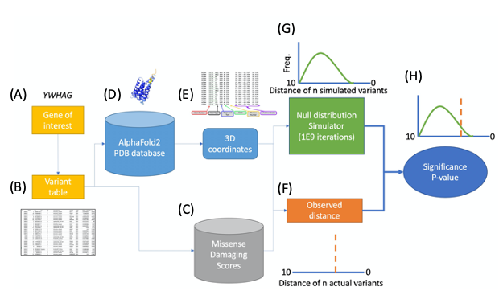

<p align="center">
   
</p>

# AlphaCluster

This codebase determines the statistical significance of clustering of
variants on coding sequence of a gene. It is designed to be used as part
of a disease cohort study, in which variants are taken from the affected
individuals.

This codebase was built on top of Jeremy McRae's `alphacluster`, which tests
clustering for de novo single-nucleotide variants, where clustering is
measured by 1 dimmensional level (the distance metric is base-pair
seperation). Our code greatly extends the initial test by:
- incorporating 3-dimmensional clustering analysis
- extending clustering analysis to protein complexes
- incorporating predictive damaging scores
- incorporating co-evolutionary clustering analysis


## How it works
<p align="center">
  
</p>
<ol type="A">
  <li>A gene of interested is selected</li>
  <li>The n variants of this gene of interest are fetched from the user specified variant table (with possible scale thresholding, which only selects some category of Dmis variants)</li>
  <li>If specified, the missense damaging scores for these variants and all potential variants are fetched for later use</li>
  <li>User specified protein or protein multimeric complex three-dimensional model is loaded</li>
  <li>The 3D coordinates of the central carbon atom of each amino acid is retrieved</li>
  <li>The observed geometric mean of the pairwise distances between each variant of the gene of interest is calculated; if desired, the pairwise distances can be inversely scaled by the sum of the damaging scores of the pair or variants which are below a given threshold can be excluded</li>
  <li>For 1E9 iterations (or an otherwise user specified iteration count), n random variants are selected from all the possible variants in the gene of interest, with respect to the underlying background mutation rate; the geometric mean is of the pairwise distances (if desired, with score scaling) is calculated and these geometric means are used to form a null distribution of geometric means</li>
  <li>The null distribution is used to designate a p-value for the observed geometric mean of the n actual variants observed in the gene of interest</li>
</ol>

## Motivation
The functional impact of missense variants is complex. A single deleterious score does not capture the complexity. For example, some variants are hypomorph, some are neomorph; some are loss of function, some are gain of function; some change the stability of the protein, some change the interaction with other proteins, and some change the enzymatic activity.

In a particular condition, the contributing missense variants are likely to have consistent functional impact. This may be reflected in smaller 3D physical distance among these variants, or functional similarity as quantified by co-evolution.

In this project, we aim to quantify clustering of 3D physical distance or functional correlation among missense variants, and to use it to improve statistical power of identifying new risk genes and to help interpretation of missense variants in genetic studies.


## Installation
For out-of-the-box version:
```sh
pip install alphacluster
```
or, if you plan to make local development on the package: 
```sh
git clone https://github.com/ShenLab/AlphaCluster.git --recurse-submodules
cd AlphaCluster
pip install . --use-feature=in-tree-build 
```

## Quick demo

It is very simple to run clustering analysis. Here is a quick demo, in which we get a p-value for 3D clustering of variants form all current major ASD trio cohorts over the protein CHD8:
```sh
alphacluster cluster --in data/asd.released.iid.hg38.txt \
--protein CHD8 \
--protein_dir proteins \
--out CHD8.demo_results.txt
```
After the script is complete, examine the results:
```sh
cat CHD8.demo_results.txt
```

## Core functionality
The core usage options are `cluster`, `cluster-1d`, `cluster-coev`, and `cluster-multi`.
The user can run these commands to perform the cluster analysis in 3-dimmensional
space, 1-dimmensional space, "co-evolution" space for a single protein, or 3-dimmensional space for a protein complex. For the returned results of these analyses, see the section on [output][#output].

### 3D space for single protein
The 3-dimmensional analysis of the package is acheived in the following command:
```sh
alphacluster cluster \
   --in data/example_de_novos.txt \
   --protein_dir protein
   --protein CDH8
   --out output.txt
```

This will run the 3d clustering analysis for the given protein (CHD8) with
xyz coordinates for each amino acid in the `protein_dir` folder. The system
assumes that there will be an `.xyz` file named `CHD8.xyz` in the `protein_dir`
folder.

### 3D space for a protein complex

### 1D space for a single protein
The 1 dimmensional analysis is acheived via the following command:
```sh
alphacluster cluster-1d \
   --in data/example_de_novos.txt \
   --protein CDH8
   --out output.txt
```

### Coevolutionary space for a single protein
The coevolutionary analysis is acheived via the following command:
```sh
alphacluster cluster-coevol \
   --in data/example_de_novos.txt \
   --coevol_dir coevol
   --protein CDH8
   --out output.txt
```

## Including damaging scores

For the 3D (both singleton and multimer versions) and 1D clustering analysis, missense damaging scores can be incorporated into the analysis. There are two approaches for doing this: scale scoreing and score thresholding.

### Scale scoring
### Scale thresholding

## Output

The tab-separated output file will contain one row per gene/transcript, with
each line containing a transcript ID or gene symbol, a log10 transformed
missense mutation rate, a log10 transformed nonsense mutation rate, and a log10
transformed synonymous mutation rate.

## Directory structure

    .
    ├── alphacluster	# Python code for clustering. 
    │
    ├── src		# C++ code for simulations.
    │
    ├── scripts    	# Helper scripts for data formating
    │			# especially .xyz, .coev.txt and
    │			# .multi file creation creation.      
    │
    ├── proteins	   # .xyz files with xyz coordinates
    │   ├── CHD8.xyz       # of the central carbon atom of
    │   ⋮ (all .xyz files) # each amino acid.
    │   └── PTEN.xyz
    │
    ├── coevolution             # .coev.txt files with 
    │   ├── CHD8.coev.txt       # pairwise coevolution  
    │   ⋮ (all .coev.txt files) # strenghts b/w amino acids
    │   └── PTEN.xyz    
    │
    ├── multimer             # .multi files with xyz coord.
    │   ├── GABA-A.multi     # of the central carbon atom of
    │   ⋮ (all .multi files) # amino acid in protein complex
    │   └── Kv1-2.multi        
    │
    ├── slurm_bulk_jobs # collection of slurm scripts used to
    │			# queue bulk runs.
    ├── tests
    ├── LICENSE
    └── README.md

## Important questions and answers

1. How do I create an .xyz file necessary for the 3D clustering analysis on a single protein?

See [helper scripts](docs/helper_scripts.md) documentation.

2. How do I create an .multi file necessary for the 3D clustering analysis on a protein complex?

See [helper scripts](docs/helper_scripts.md) documentation.

3. Where can I get missense enrichment p-values via the Poisson test? And how do I fisher combine them with the clustering analysis?

See [enrichment tests](docs/enrichment.md) documentation.

4. Can I get missense enrichment p-values via DenovoWEST?

See [enrichment tests](docs/enrichment.md) documentation.

